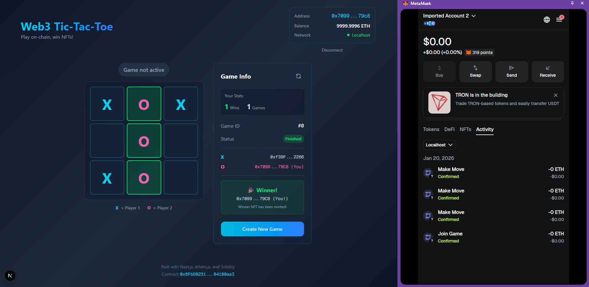

# 🎮 Web3 Tic-Tac-Toe

A decentralized Tic-Tac-Toe game built on the blockchain! Play against friends, make moves on-chain, and win NFTs as proof of your victories.

  

## 📸 Demo

### Screenshot



### Video Demo

./tick-tac-toe.mp4


<video src="./tick-tac-toe.mp4" controls width="100%"></video>

## ✨ Features

- **On-Chain Gameplay**: All game moves are recorded on the blockchain
- **MetaMask Integration**: Connect your wallet to play
- **NFT Rewards**: Winners automatically receive an NFT trophy
- **Multi-Network Support**: Deploy on Localhost, Sepolia, or Polygon testnets
- **Player Stats**: Track your wins and total games played
- **Real-time Updates**: Board syncs automatically between players
- **Responsive Design**: Play on desktop or mobile

## 🏗️ Project Structure

```
├── app/                    # Next.js app directory
│   ├── page.tsx           # Main game page
│   ├── layout.tsx         # Root layout
│   └── globals.css        # Global styles
├── components/            # React components
│   ├── Board.tsx          # Game board component
│   ├── WalletButton.tsx   # Wallet connection UI
│   └── GameInfo.tsx       # Game info panel
├── contracts/             # Solidity smart contracts
│   └── TicTacToe.sol      # Main game contract
├── lib/                   # Utilities and hooks
│   ├── config.ts          # Configuration constants
│   ├── types.ts           # TypeScript types
│   ├── useWallet.ts       # Wallet connection hook
│   └── useContract.ts     # Contract interaction hook
├── scripts/               # Deployment scripts
│   └── deploy.ts          # Contract deployment
├── hardhat.config.ts      # Hardhat configuration
└── package.json           # Dependencies
```

## 🚀 Quick Start

### Prerequisites

- **Node.js** v18+ and npm/pnpm
- **MetaMask** browser extension
- **Git** for cloning the repository

### Step 1: Install Dependencies

```bash
# Clone the repository (if not already)
git clone https://github.com/Dalcio/Tic-Tac-Toe-web3.git
cd Tic-Tac-Toe-web3

# Install all dependencies
pnpm install
```

### Step 2: Compile the Smart Contract

```bash
pnpm compile
```

### Step 3: Start Local Blockchain

Open **Terminal 1** and start the Hardhat local node:

```bash
pnpm node
```

Keep this terminal running! You'll see 20 test accounts with 10000 ETH each.

### Step 4: Deploy the Contract

Open **Terminal 2** and deploy:

```bash
pnpm deploy:localhost
```

This will:

- Deploy the contract
- Save the address to `.env.local` automatically
- Show the contract address in the console

### Step 5: Start the Frontend

In **Terminal 2** (or a new terminal), run:

```bash
pnpm dev
```

Open [http://localhost:3000](http://localhost:3000) to play!

## 🦊 MetaMask Setup

### Adding Localhost Network

1. Open MetaMask
2. Click the network dropdown → "Add network" → "Add network manually"
3. Enter these details:
   - **Network Name**: Localhost 8545
   - **RPC URL**: http://127.0.0.1:8545
   - **Chain ID**: 31337
   - **Currency Symbol**: ETH

### Importing Test Accounts

When you run `npm run node`, Hardhat displays test accounts with private keys:

```
Account #0: 0xf39Fd6e51aad88F6F4ce6aB8827279cffFb92266 (10000 ETH)
Private Key: 0xac0974bec39a17e36ba4a6b4d238ff944bacb478cbed5efcae784d7bf4f2ff80
```

To import into MetaMask:

1. Click account icon → "Import account"
2. Paste the private key
3. Repeat for second account (for two-player testing)

## 🎯 How to Play

1. **Connect Wallet**: Click "Connect Wallet" and approve in MetaMask
2. **Create Game**: Click "Create New Game" - you'll be Player X
3. **Share Game ID**: Tell your friend the game ID
4. **Join Game**: Friend connects wallet and clicks "Join" on your game
5. **Make Moves**: Click cells when it's your turn
6. **Win NFT**: Winner automatically receives a trophy NFT!

## 🔗 Deploying to Testnets

### Sepolia (Ethereum Testnet)

1. Get test ETH from [Sepolia Faucet](https://sepoliafaucet.com/)

2. Make sure your `.env` has:

   ```env
   PRIVATE_KEY=your_wallet_private_key
   SEPOLIA_RPC_URL=https://eth-sepolia.g.alchemy.com/v2/your-api-key
   ```

3. Deploy:
   ```bash
   pnpm deploy:sepolia
   ```

### Polygon Amoy (Polygon Testnet)

1. Get test MATIC from [Polygon Faucet](https://faucet.polygon.technology/)

2. Make sure your `.env` has:

   ```env
   PRIVATE_KEY=your_wallet_private_key
   AMOY_RPC_URL=https://polygon-amoy.g.alchemy.com/v2/your-api-key
   ```

3. Deploy:
   ```bash
   pnpm deploy:amoy
   ```

### Polygon Mainnet

1. Make sure you have MATIC for gas

2. Deploy:
   ```bash
   pnpm deploy:polygon
   ```

## 📄 Smart Contract Details

### TicTacToe.sol

The contract implements:

- **Game Creation**: `createGame()` - Creates a new game, caller becomes Player X
- **Join Game**: `joinGame(gameId)` - Join as Player O
- **Make Move**: `makeMove(gameId, position)` - Place X or O (0-8 position)
- **Winner Check**: Automatic on-chain winner detection
- **NFT Minting**: ERC-721 token minted to winner

### Game States

| State              | Description                      |
| ------------------ | -------------------------------- |
| `WaitingForPlayer` | Created, waiting for Player 2    |
| `InProgress`       | Both players joined, game active |
| `Finished`         | Game won by a player             |
| `Draw`             | All cells filled, no winner      |

### Board Layout

```
0 | 1 | 2
---------
3 | 4 | 5
---------
6 | 7 | 8
```

## 🌐 Frontend Deployment

### Deploy to Vercel

1. Push your code to GitHub
2. Visit [Vercel](https://vercel.com/) and import your repository
3. Add environment variable:
   - `NEXT_PUBLIC_CONTRACT_ADDRESS` = your deployed contract address
4. Deploy!

### Deploy to Netlify

1. Build the project:
   ```bash
   npm run build
   ```
2. Deploy the `out` folder to Netlify
3. Set the same environment variable

## 🧪 Testing Two Players

### Local Testing (Same Computer)

1. Open two browser windows/tabs
2. In each, connect a different MetaMask account
3. Player 1 creates a game
4. Player 2 joins the game
5. Take turns making moves!

### Testing with Friends

1. Deploy to a testnet (Sepolia/Amoy)
2. Both players install MetaMask and add the testnet
3. Both get test tokens from faucet
4. Share the website URL
5. Play!

## 🛠️ Development Commands

| Command                 | Description                    |
| ----------------------- | ------------------------------ |
| `pnpm dev`              | Start Next.js dev server       |
| `pnpm build`            | Build for production           |
| `pnpm compile`          | Compile Solidity contracts     |
| `pnpm node`             | Start local Hardhat network    |
| `pnpm deploy:localhost` | Deploy to local network        |
| `pnpm deploy:sepolia`   | Deploy to Sepolia testnet      |
| `pnpm deploy:amoy`      | Deploy to Polygon Amoy testnet |
| `pnpm deploy:polygon`   | Deploy to Polygon mainnet      |
| `pnpm test`             | Run smart contract tests       |

## 📚 Tech Stack

- **Frontend**: Next.js 16, React 19, TypeScript, TailwindCSS
- **Blockchain**: Solidity 0.8.20, Hardhat
- **Web3**: ethers.js 6.x
- **NFT**: OpenZeppelin ERC-721

## 🤝 Contributing

Contributions are welcome! Please feel free to submit a Pull Request.

## 📜 License

MIT License - feel free to use this project for learning and building!

## 🙋 Troubleshooting

### "MetaMask is not installed"

Install the MetaMask browser extension from [metamask.io](https://metamask.io/)

### "Contract address not configured"

Make sure you've created `.env.local` with `NEXT_PUBLIC_CONTRACT_ADDRESS`

### "Wrong network"

Switch MetaMask to the network where the contract is deployed (Localhost, Sepolia, etc.)

### Transaction fails

- Make sure you have enough ETH/MATIC for gas
- Check you're on the correct network
- Ensure it's your turn to play

### Can't connect to localhost

- Verify Hardhat node is running (`npm run node`)
- Check MetaMask is configured for localhost (Chain ID: 31337)
